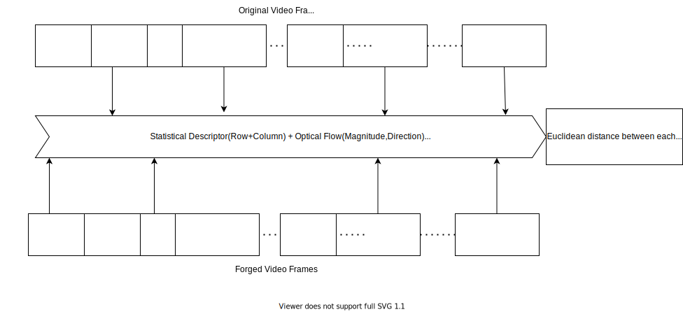
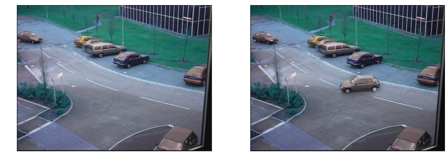
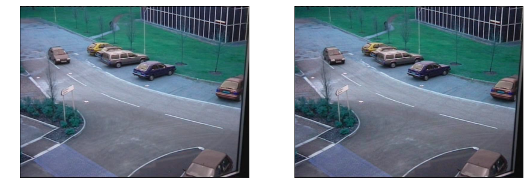

<!-- ---
title: Video Forensics

Author: SHUBHAM JAISWAL AND VAIBHAV RATHORE
--- -->
# 
Video Forensics

## 
 SHUBHAM JAISWAL 
 
## Aim:
Location of the manipulations among the real and forged video sequences.

## Video Description:

**`Frame Details`**

> -   Height: 576
> -   Width: 768
> -   FPS: 30
> -   Total Frames: 390

There is movement of only one car in the real video throughout all the time. While, the only change in forged video is the movement of another car other than the original one for approximately _1sec_ i.e. _30-40 frames_. Afterwards, both forged and real videos are the *same* in appearance.  

 Orginal video frame sequence
  

 Forged video frame sequence

## Approach

## Results
> 1. Orginal Frame
> 2. Forged Frame
> 3. Combined(Statistical+Optical Flow)
> 4. Optical Flow
> 5. Statistical
<!--  
         -->
### Result 1

### Result 2

### Result 3

### Result 4

## Conclusion
The modifications in the forged video was quite evident using both statistical and optical flow. The optical flow is obviously dominating in the overall error localization. 
I hope the results would have been more clearer if smaller block size is taken into consideration for feature calculation.
